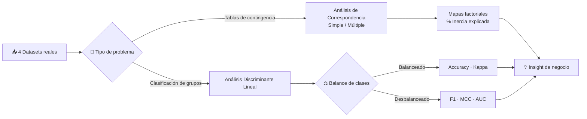

<div align="center">

## Análisis de Correspondencia y Discriminante Multivariado 🔍


*Cuatro casos de negocio resueltos con técnicas de reducción de dimensionalidad y clasificación multivariada: desde posicionamiento de marca hasta detección temprana de enfermedad en producción ganadera.*

**[📄 Ver informe completo](https://joseluis02678.github.io/Applied-Multivariate-Analysis/PC2/Práctica_Calificada02_Grupo01.html)** · **[💼 LinkedIn](https://www.linkedin.com/in/jose-l-garay/)**

</div>

---

## 🎯 Resumen Ejecutivo

Este repositorio reúne cuatro proyectos de análisis multivariado aplicados a problemas reales de negocio, salud y política pública: posicionamiento turístico, brechas de habitabilidad, diagnóstico nutricional infantil y detección temprana de enfermedad en ganado lechero.

**Habilidades demostradas:**
- Traducción de tablas de contingencia y encuestas en insights accionables (Análisis de Correspondencia Simple y Múltiple)
- Construcción de reglas de clasificación robustas para escenarios balanceados y desbalanceados (Análisis Discriminante Lineal)
- Diagnóstico riguroso de supuestos estadísticos (normalidad multivariada, homogeneidad de covarianzas, multicolinealidad)
- Selección de métricas apropiadas según el contexto de negocio (Accuracy/Kappa en datos balanceados; F1, MCC, AUC en datos desbalanceados)
- Comunicación de resultados técnicos mediante visualizaciones interpretables (biplots, mapas factoriales, curvas ROC)

---

## 🔄 Flujo Metodológico



---

## 📂 Casos de Estudio

### 1. Posicionamiento de Marca País — Cuzco vs. Destinos Turísticos Globales
**Técnica:** Análisis de Correspondencia Simple (ACS) · **Muestra:** 2,451 encuestas + 558 de "destino ideal"

Evalúa cómo perciben los viajeros internacionales a Cuzco frente a París, Tokio, Madrid, Ciudad de México y Nueva York, en atributos como gastronomía, historia, seguridad y costo.

- Prueba Chi-cuadrado confirma asociación significativa (χ² = 284.75, p < 0.001)
- 2 dimensiones capturan el 88.79% de la inercia total
- **Insight de negocio:** Cuzco se posiciona como destino "Cultural-Económico" (gastronomía + historia), pero queda lejos del eje de Seguridad que domina Tokio — una brecha clara para estrategias de marca país.

### 2. Brechas de Habitabilidad en el Perú
**Técnica:** Análisis de Correspondencia Múltiple (ACM) · **Muestra:** 33,333 hogares (ENAHO 2025)

Mapea la relación entre cinco indicadores estructurales de vivienda (estrato, paredes, pisos, agua, saneamiento) a nivel nacional.

- Matriz Disyuntiva Completa y Tabla de Burt sobre 15 categorías
- 2 dimensiones retienen 41.5% de la inercia total; las 10 pruebas Chi-cuadrado bivariadas son significativas (p < 0.001)
- **Insight de negocio:** La Dimensión 1 (27.7%) revela la brecha urbano-rural clásica. El saneamiento es el indicador con mayor poder discriminante (V de Cramer = 0.44), lo que lo convierte en la variable prioritaria para focalizar política pública.

### 3. Diagnóstico Nutricional Infantil (Datos Balanceados)
**Técnica:** Análisis Discriminante Lineal · **Muestra:** 150 niños, diseño balanceado (50 por grupo)

Clasifica el estado nutricional (Normal / Riesgo / Desnutrición) de niños de zonas rurales a partir de variables antropométricas y bioquímicas.

- Verificación completa de supuestos (Shapiro-Wilk multivariado, M de Box, ANOVA univariado) y selección de variables vía Lambda de Wilks, Boruta y Random Forest
- **Resultado:** AUC = 1.000 en la comparación Normal vs. Desnutrición (discriminación perfecta); Accuracy 93–97% con Kappa > 0.80 — un modelo listo para apoyar tamizaje nutricional en campo.

### 4. Detección Temprana de Hipocalcemia en Ganado Lechero (Datos Desbalanceados)
**Técnica:** Análisis Discriminante Lineal · **Muestra:** 1,000 vacas Holstein (90% sanas / 10% enfermas)

Aborda un problema clásico de clases desbalanceadas en un contexto veterinario-productivo de alto impacto económico.

- Se descarta el Accuracy como métrica principal (un modelo trivial alcanzaría 90%) a favor de Sensibilidad, F1, MCC, AUC, CSI y ETS
- **Insight de negocio:** El calcio preparto es el biomarcador más fuerte (correlación de -0.784 con la función discriminante). Con AUC = 0.868 el modelo discrimina bien, pero el umbral de decisión estándar (0.5) deja pasar demasiados casos enfermos (sensibilidad = 0.267) — se recomienda bajar el umbral a ~0.25–0.30 o aplicar balanceo (ROSE/SMOTE) antes de producción.

---

## 🛠️ Stack Tecnológico

| Categoría | Herramientas |
|---|---|
| Lenguaje | R |
| Análisis de Correspondencia | `FactoMineR`, `ca`, `anacor`, `factoextra`, `vegan`, `FactoClass` |
| Análisis Discriminante | `MASS` (lda), `klaR` (greedy.wilks), `biotools` (Box M), `mvnormtest` |
| Manipulación y Visualización | `tidyverse`, `dplyr`, `ggplot2`, `GGally`, `corrplot`, `Hmisc` |
| Validación y Métricas | `caret`, `caTools` (colAUC), `pROC`, `psych` (Kappa), `EnvStats` (Rosner) |
| Selección de Variables | `Boruta`, `randomForest`, `vip` |
| Reportes | Quarto / RMarkdown (`knitr`, `kableExtra`, `gtsummary`) |

---

## 📊 Métricas de Evaluación

| Técnica | Métrica Principal | Umbral Aceptable |
|---|---|---|
| ACS / ACM | Inercia explicada acumulada | ≥ 40% (ACM) / 80% (ACS) |
| ACS / ACM | Calidad de representación (cos²) | ≥ 0.80 |
| Discriminante | Lambda de Wilks | p < 0.05 |
| Discriminante | Tasa de clasificación correcta | ≥ 75% |
| Discriminante | Kappa de Cohen | ≥ 0.60 |
| Discriminante (desbalance) | AUC | ≥ 0.80 |
| Discriminante (desbalance) | MCC | ≥ 0.30 |

---

## 📁 Estructura del Repositorio

```text
Applied-Multivariate-Analysis/PC2
│
├── 📖 README.md
├── 📂 notebooks/
│   └── 🧪 Práctica_Calificada02_Grupo01.qmd
│
├── 📂 data/
│   ├── 🩺 Dataset_Hipocalcemia_4.xlsx
│   ├── 📊 Enaho01-2025-100.csv
│   └── 📋 datos.xlsx
│
├── 📂 scripts/
└── ⚙️ .gitignore
```

---

## 👨‍💻 Autor

**Jose Luis Garay Ramos**
Estudiante de Estadística especializado en transformar datos complejos en análisis interpretables mediante metodologías estadísticas sólidas y programación en R/Python. En este proyecto lideré la integración y consolidación de las bases de datos, unificando los pipelines de análisis y estructurando el código del repositorio.

[](https://www.linkedin.com/in/jose-l-garay/)
[](mailto:joseluisgarayramos23@gmail.com)

### 👥 Equipo de Investigación — Grupo 1

<div align="center">

<table>
<tr>
<td align="center" width="180"><b>Jose Luis Garay Ramos</b><br><sub>Integración de datos ·<br>Estructuración del repo</sub></td>
<td align="center" width="180"><b>Angel D. Meza Asto</b></td>
<td align="center" width="180"><b>Daniel Kenyi<br>Ormeño Sakihama</b></td>
</tr>
<tr>
<td align="center" width="180"><b>Melany Alexandra<br>Ancco Guzman</b></td>
<td align="center" width="180"><b>Jonnathan<br>Pedraza Laboriano</b></td>
<td align="center" width="180"><b>Fiorella<br>Fuentes Bueno</b></td>
</tr>
<tr>
<td align="center" width="180" colspan="3"><b>Fiorella Romina<br>Sobero Aguirre</b></td>
</tr>
</table>

</div>

---
