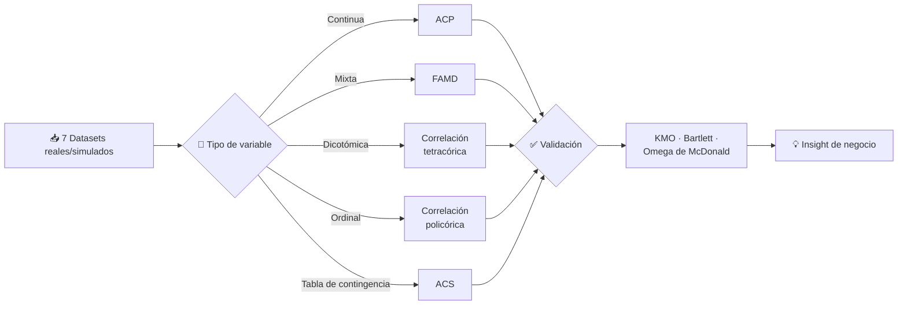

<div align="center">

## Reducción de Dimensionalidad y Modelos Factoriales 📊


*Siete técnicas de reducción de dimensionalidad y análisis factorial aplicadas a problemas reales de agroindustria, macroeconomía, educación, bienestar laboral, e-commerce y salud ocupacional.*

**[📄 Ver informe completo](https://joseluis02678.github.io/Applied-Multivariate-Analysis/Parcial/grupo1_EVC_completo.html)** · **[💼 LinkedIn](https://www.linkedin.com/in/jose-l-garay/)**

</div>

---

## 🎯 Resumen Ejecutivo

Este examen parcial reúne siete proyectos de análisis multivariado de interdependencia aplicados sobre datos reales y simulados: calidad del café, ahorro macroeconómico, desempeño escolar, bienestar laboral, hábitos de e-commerce, constructos organizacionales y estrés laboral.

**Habilidades demostradas:**
- Selección de la técnica de reducción dimensional apropiada según el tipo de dato: continuo (ACP), mixto (FAMD), dicotómico (tetracórica) y ordinal (policórica)
- Diagnóstico de multicolinealidad (VIF), normalidad multivariada, esfericidad de Bartlett y adecuación muestral (KMO) antes de cualquier extracción factorial
- Interpretación sustantiva de factores y componentes latentes, más allá del ajuste numérico — cada dimensión se traduce en un perfil o insight accionable
- Validación robusta de modelos mediante validación cruzada, análisis paralelo y verificación de fiabilidad (Omega de McDonald)
- Manejo de valores atípicos multivariados (Mahalanobis) y su efecto en la estructura factorial final

---

## 🔄 Flujo Metodológico



---

## 📂 Casos de Estudio

### 1. Calidad del Café Arábica — Regresión Lineal Multivariada
**Contexto:** ¿Qué condiciones ambientales explican la calidad química (VOCs, acidez, TDS) de 199 lotes de café de la selva alta peruana?

Se depuró el modelo eliminando primero la temperatura por colinealidad severa con la altitud (VIF > 10) y luego la precipitación por no ser significativa (p = 0.1052), validando normalidad, homocedasticidad y esfericidad en cada etapa.

- **Resultado:** R² ajustado entre 82% y 90%, MAPE entre 2.2% y 6.1%, estable en validación cruzada 100x
- **Insight de negocio:** Altitud, horas de sol y materia orgánica del suelo son las tres palancas que realmente definen la calidad del grano — una guía directa para decisiones de selección de parcelas y manejo agronómico.

### 2. Ahorro Agregado de los Hogares — Análisis de Componentes Principales (ACP)
**Contexto:** Reducir cinco indicadores macroeconómicos (`LifeCycleSavings`, 50 países, 1960–1970) a las dimensiones que realmente explican el comportamiento del ahorro.

- **Resultado:** 2 componentes explican 84.07% de la varianza
- **Insight de negocio:** CP1 captura la transición demográfica e ingreso; CP2 el dinamismo económico — dos ejes ortogonales que permiten segmentar países por perfil de ahorro sin redundancia entre variables.

### 3. Desempeño Escolar — Análisis Factorial Clásico (AFC)
**Contexto:** Identificar los perfiles latentes detrás del promedio general de 200 estudiantes de secundaria (colegio Trilce, Lima).

- **Resultado:** 3 factores, 83.5% de varianza explicada, comunalidades todas > 0.78
- **Insight de negocio:** El promedio esconde perfiles muy distintos: Habilidad Verbal, Consistencia Académica y Habilidad Cuantitativa son dimensiones independientes — un alumno puede tener alto potencial cuantitativo y baja consistencia, algo que el promedio nunca revelaría. Base directa para tutorías diferenciadas.

### 4. Bienestar Laboral — Análisis Factorial de Datos Mixtos (FAMD)
**Contexto:** Combinar variables cuantitativas (salario, horas, estrés) y cualitativas (área, modalidad, burnout) de 350 empleados sin tener que descartar ningún tipo de variable.

- **Resultado:** 3 dimensiones interpretables tras verificar Bartlett, KMO iterativo y outliers
- **Insight de negocio:** Bienestar psicológico, carga laboral/modalidad y perfil socioeconómico son ejes independientes — el burnout se asocia claramente a la primera dimensión, orientando dónde debe intervenir RR.HH. primero.

### 5. Hábitos de E-commerce y Constructo Organizacional — AF Dicotómico y Ordinal
**Contexto:** Validar instrumentos de medición con datos Sí/No (seguridad y hábitos de compra online, n = 500) y Likert 1–5 (proactividad, liderazgo, empatía, n = 250).

- **Resultado:** Estructura de 2 y 3 factores respectivamente, cargas > 0.80, fiabilidad Omega > 0.90 en ambos casos
- **Insight de negocio:** Se usó correlación tetracórica y policórica (no Pearson) para no subestimar las relaciones entre ítems categóricos — un instrumento de encuesta mal validado estadísticamente puede llevar a decisiones de producto o de talento erróneas.

### 6. Estrés Laboral y Afrontamiento — Análisis de Correspondencia Simple (ACS)
**Contexto:** ¿Existe asociación entre el nivel de estrés y la estrategia de afrontamiento en 300 trabajadores corporativos?

- **Resultado:** χ² = 114.54 (p < 0.001); el Eje 1 explica 93.8% de la inercia total
- **Insight de negocio:** Existe un gradiente claro: a mayor estrés, migración de estrategias preventivas (deporte, meditación) hacia respuestas clínicas/pasivas (medicación, evitación) — evidencia para diseñar intervenciones tempranas antes de que el trabajador dependa de respuestas pasivas.

---

## 🛠️ Stack Tecnológico

| Categoría | Herramientas |
|---|---|
| Lenguaje | R |
| Regresión y Diagnóstico | `car`, `lmtest`, `rms`, `performance` |
| Reducción Dimensional | `ade4`, `FactoMineR`, `factoextra` |
| Correlaciones Especiales | `psych` (tetracórica, policórica), `polycor` |
| Análisis de Correspondencia | `FactoMineR::CA`, `gmodels` |
| Valores Perdidos y Atípicos | `mice`, `naniar`, `mahalanobis` |
| Visualización | `ggplot2`, `corrplot`, `ggcorrplot`, `GGally`, `PerformanceAnalytics` |
| Reportes | Quarto (`knitr`, `kableExtra`, `DT`) |

---

## 📁 Estructura de la Carpeta

```text
Parcial/
│
├── 📖 README.md
├── 🧪 grupo1_EVC_completo.qmd
├── 🌐 grupo1_EVC_completo.html
│
├── 📂 data/
│   ├── p1_regre_cafe.csv
│   ├── data_colegio_p3.csv
│   ├── Datos_Dicotomicos.xlsx
│   ├── Datos_Ordinales.xlsx
│   └── Data_Estres_Afrontamiento_300Trabajadores.csv
│
├── 🖼️ logo.png
└── ⚙️ .gitignore
```

---

## 👨‍💻 Autor

**Jose Luis Garay Ramos**
Estudiante de Estadística especializado en transformar datos complejos en análisis interpretables mediante metodologías estadísticas sólidas y programación en R/Python. En este proyecto lideré la integración y consolidación de las bases de datos, unificando los pipelines de análisis y estructurando el código del repositorio.

[](https://www.linkedin.com/in/jose-l-garay/)
[](mailto:joseluisgarayramos23@gmail.com)

### 👥 Equipo de Investigación — Grupo 1

<div align="center">

<table>
<tr>
<td align="center" width="180"><b>Jose Luis Garay Ramos</b><br><sub>Integración de datos ·<br>Estructuración del repo</sub></td>
<td align="center" width="180"><b>Angel D. Meza Asto</b></td>
<td align="center" width="180"><b>Daniel Kenyi<br>Ormeño Sakihama</b></td>
</tr>
<tr>
<td align="center" width="180"><b>Melany Alexandra<br>Ancco Guzman</b></td>
<td align="center" width="180"><b>Jonnathan<br>Pedraza Laboriano</b></td>
<td align="center" width="180"><b>Fiorella<br>Fuentes Bueno</b></td>
</tr>
<tr>
<td align="center" width="180" colspan="3"><b>Fiorella Romina<br>Sobero Aguirre</b></td>
</tr>
</table>

</div>

---
