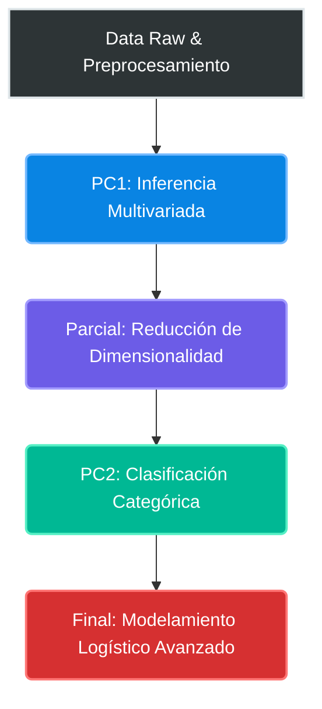

<div align="center">
  
  <h1><b>Análisis Multivariado Aplicado</b></h1>
  <h3>Universidad Nacional Agraria La Molina | Semestre 2026-I</h3>
  <p><i>Implementación de métodos estadísticos, extracción de características y reducción de dimensionalidad</i></p>
  
  
  
  
</div>

---

## 🎯 ¿Qué es este repositorio?

Este repositorio contiene la implementación de **proyectos aplicados de estadística multivariada** desarrollados durante el curso de Técnicas Multivariadas (UNALM, 2026-I). Cada proyecto resuelve problemas reales de negocio e investigación utilizando métodos avanzados para:

- 📊 **Comparar grupos** evaluando múltiples variables simultáneamente (MANOVA, Hotelling T²).
- 📉 **Reducir dimensionalidad** de datasets complejos (PCA, Análisis Factorial).
- ️ **Clasificar individuos** en categorías conocidas (Análisis Discriminante).
-  **Modelar variables categóricas** y de conteo (Regresión Logística Binaria, Multinomial, Ordinal y Poisson Robusta).

---

## 📑 Informes Interactivos

Accede directamente a los informes renderizados en GitHub Pages:

| Evaluación | Tema Principal | Informe HTML |
|------------|----------------|--------------|
| **PC1** | Inferencia Multivariada (Z², Hotelling T², MANOVA, MANCOVA) | [Ver Informe](https://joseluis02678.github.io/Applied-Multivariate-Analysis/PC1/PC1%20-%20Grupo%201.html) |
| **Parcial** | Reducción de Dimensionalidad (PCA, Análisis Factorial) | [Ver Informe](https://joseluis02678.github.io/Applied-Multivariate-Analysis/Parcial/grupo1_EVC_completo.html) |
| **PC2** | Análisis de Correspondencia y Discriminante (ACS, ACM, ADL) | [Ver Informe](https://joseluis02678.github.io/Applied-Multivariate-Analysis/PC2/Práctica_Calificada02_Grupo01.html) |
| **Final** | Modelamiento Logístico Avanzado (Regresión Logística Binaria, Multinomial, Ordinal) | [Ver Informe](https://joseluis02678.github.io/Applied-Multivariate-Analysis/Final/Final%20-%20Grupo%201.html) |

---

##  Integrantes del Equipo

*   **[@jonnathan2023](https://github.com/jonnathan2023)** — Jonathan Pedraza
*   **[@AngelMol0810](https://github.com/AngelMol0810)** — Angel Meza
*   **[@Orsaki](https://github.com/Orsaki)** — Daniel Ormeño
*   **[@joseluis02678](https://github.com/joseluis02678)** — Jose Luis Garay Ramos
*   **[@fiorellasob](https://github.com/fiorellasob)** — Fiorella Sobero
*   **Melany Alexandra Ancco Guzman** *(Colaboradora)*
*   **Fiorella Fuentes Bueno** *(Colaboradora)*

---

## 📂 Estructura del Repositorio

```
Applied-Multivariate-Analysis/
├── PC1/
│   ├── PC1 - Grupo 1.qmd
│   ├── PC1 - Grupo 1.html
│   ├── README.md
│   └── data/
├── Parcial/
│   ├── grupo1_EVC_completo.qmd
│   ├── grupo1_EVC_completo.html
│   └── data/
├── PC2/
│   ├── Práctica_Calificada02_Grupo01.qmd
│   ├── Práctica_Calificada02_Grupo01.html
│   └── data/
├── Final/
│   ├── Final - Grupo 1.qmd
│   ├── Final - Grupo 1.html
│   ├── Codigo_Completo_Final.R
│   ├── modelo_logit.rds
│   ├── modelo_logbinomial.rds
│   └── data/
├── .gitignore
├── README.md
└── logo.png
```

---

### 🔄 Arquitectura del Proyecto y Flujo de Evaluaciones

El siguiente esquema representa el pipeline analítico desarrollado a lo largo del ciclo, abarcando desde la inferencia inicial hasta el modelamiento predictivo avanzado.


