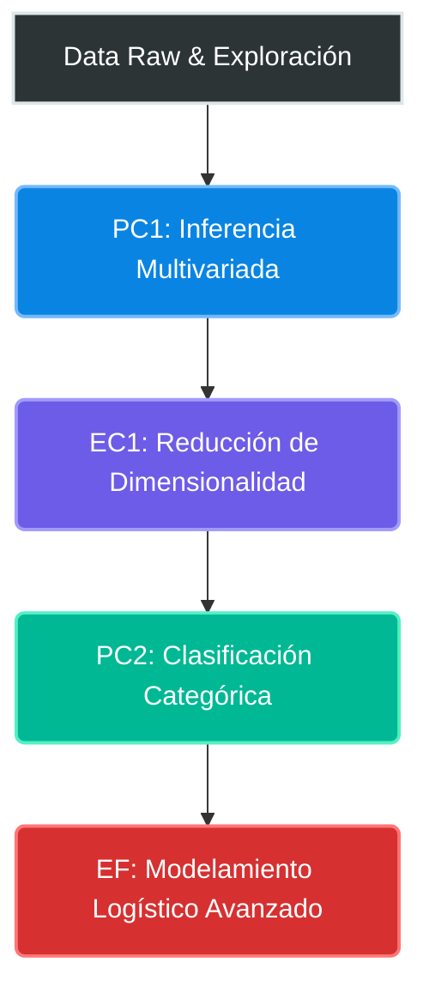

  <h1><b>Análisis Multivariado Aplicado</b></h1>
  <h3>Universidad Nacional Agraria La Molina | Semestre 2026-I</h3>
  
<i>Implementación de métodos estadísticos, extracción de características y reducción de dimensionalidad</i>

---

### Integrantes del Equipo

*   **[@jonnathan2023](https://github.com/jonnathan2023)** — Jonathan Pedraza
*   **[@AngelMol0810](https://github.com/AngelMol0810)** — Angel Meza
*   **[@Orsaki](https://github.com/Orsaki)** — Daniel Ormeño
*   **[@joseluis02678](https://github.com/joseluis02678)** — Jose Luis Garay Ramos
*   **[@fiorellasob](https://github.com/fiorellasob)** — Fiorella Sobero
*   **Melany Alexandra Ancco Guzman** *(Colaboradora)*
*   **Fiorella Fuentes Bueno** *(Colaboradora)*

---

### Arquitectura del Curso y Flujo de Evaluaciones

El siguiente esquema representa el pipeline analítico desarrollado a lo largo del ciclo, abarcando desde la inferencia inicial hasta el modelamiento predictivo avanzado.

